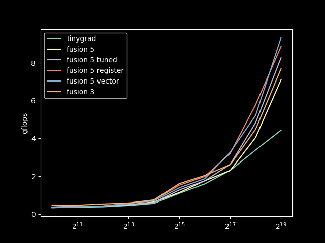

# [FastSoftmax](https://github.com/SzymonOzog/FastSoftmax) on [tinygrad](https://github.com/tinygrad/tinygrad)

$$\Large\text{softmax}(x_i) = \frac{e^{x_i - max(x)}}{\sum_{j=1}^{K} e^{x_j - max(x)}}$$

[How DRAM works and why should you care | GPU Programming](https://www.youtube.com/watch?v=huhg3V4ZRW0)

# kernel
## base
one kernel

## fusion 5
break down to small kernel:
- reduce local max
- reduce global max
- reduce local exp
- reduce global exp
- div

## fusion 5 tuned
tune param for each kernel

## fusion 5 register
share data at register level

## fusion 5 vector
load data in vector. less instruction

## fusion 3
exp(x - max) = exp(x - local\_max) * exp(local\_max - global\_max)

- reduce local max and sum
- reduce global max and sum
- div

small input: fusion 3 save kernel launch overhead and memory pass

big input: fusion 5 simple, high-occupancy kernels are better at hiding memory latency, leading to higher effective memory bandwidth and performance.

# perf

