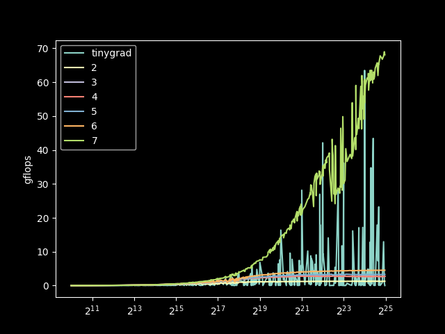

$$\Large\text{softmax}(x_i) = \frac{e^{x_i - max(x)}}{\sum_{j=1}^{K} e^{x_j - max(x)}}$$

[How DRAM works and why should you care | GPU Programming](https://www.youtube.com/watch?v=huhg3V4ZRW0)

[FastSoftmax](https://github.com/SzymonOzog/FastSoftmax)

# kernel
data = [d1, d2, d3, d4]

## 1
```
thread 1 max(d1, d2, d3, d4) -> sum(exp(data[i] - max)) -> exp(d1 - max) / sum
thread 2 max(d1, d2, d3, d4) -> sum(exp(data[i] - max)) -> exp(d2 - max) / sum
thread 3 max(d1, d2, d3, d4) -> sum(exp(data[i] - max)) -> exp(d3 - max) / sum
thread 4 max(d1, d2, d3, d4) -> sum(exp(data[i] - max)) -> exp(d4 - max) / sum
```

## 2
```
thread 1 max(d1, d2)
thread 2 max(d3, d4)
reduce thread max -> max(d1, d2, d3, d4)

thread 1 sum(exp(d1 - max), exp(d2 - max))
thread 2 sum(exp(d3 - max), exp(d4 - max))
reduce thread sum -> sum(exp(data[i] - max))

thread 1 exp(d1 - max) / sum, exp(d2 - max) / sum
thread 2 exp(d3 - max) / sum, exp(d4 - max) / sum
```

## 3
coalescing
```
thread 1 max(d1, d3)
thread 2 max(d2, d4)
reduce thread max -> max(d1, d2, d3, d4)

thread 1 sum(exp(d1 - max), exp(d3 - max))
thread 2 sum(exp(d2 - max), exp(d4 - max))
reduce thread sum -> sum(exp(data[i] - max))

thread 1 exp(d1 - max) / sum, exp(d3 - max) / sum
thread 2 exp(d2 - max) / sum, exp(d4 - max) / sum
```

## 4
lockstep
```
simd_max
simd_sum
```

## 5
Online normalizer calculation for softmax
```
exp(data - global_max) = exp(data - local_max) * exp(local_max - global_max)
```

## 6
vector
```
float4
```

## 7
multi pass reduce

loop unrolling
```
sm1
thread 1 max(d1, local_max) -> sum(old_sum * exp(local_max - max), exp(d1 - max))
thread 1 max(d2, local_max) -> sum(old_sum * exp(local_max - max), exp(d2 - max))

sm2
thread 1 max(d3, local_max) -> sum(old_sum * exp(local_max - max), exp(d3 - max))
thread 1 max(d4, local_max) -> sum(old_sum * exp(local_max - max), exp(d4 - max))

---

sm1
max(sm1_max, sm2_max) -> sum(sm1_sum * exp(sm1_max - max), sm2_sum * exp(sm2_max - max))

---

sm1
thread 1 exp(d1 - max) / sum
thread 1 exp(d2 - max) / sum

sm2
thread 1 exp(d3 - max) / sum
thread 1 exp(d4 - max) / sum
```

# perf

